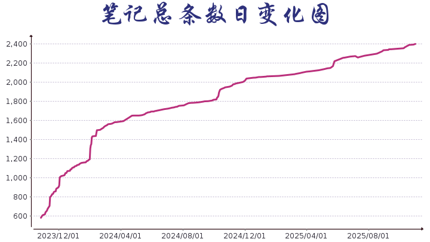

更新于: <b>2024/10/10 23:13:27</b>

当前笔记总条数: <b>1858</b>

当前笔记本数: <b>60</b>

当前美文总数: <b>52</b>

# 手帐札记本
> 这只是一份简单的笔记本吖！

阅读，最高的境界是“消化”，不是去消化自己所读到的内容，而是通过阅读，去消化那些已经发生在自己身上的人生内容。

⭐️这是在阅读过程中摘抄了一些有趣的语句的收集本，也是可以时常拿出来去重新品读名言警句的魅力的笔记本，不断的汲取书籍中的养分，时常给自己充充电。

一册经典，如同一杯陈年佳酿、一位故旧老友，那种熟悉感，自非旁人可知。

**此仓库的README文件每日自动更新，随机选择六条语句作为每日一言。此外，页面还会展示最近的15条更新记录，并提供笔记本的目录供查阅。**

希望此仓库能给大家带来帮助！🌸

## 每日一言
> 来源: [杂志摘录](杂志摘录.md) **世界是美丽的，一切都有可能发生。**

> 来源: [古龙](图书笔记/古龙.md) **有所不为，有所必为。每个人这一生中都在做一些他本来不愿的事，他的生命才有意思。**

> 来源: [随手记录](随手记录.md) **当你压力大到快要崩溃，不要跟别人讲，也不要觉得自己委屈，没有人会心疼你。要像余华说的那样:“在夜深人静的时候，把心掏出来，自己缝缝补补，然后睡一觉起来，又是信心百倍。无人问津也好，技不如人也罢，你都要安静下来，去做自己该做的事情，而不是让烦恼和焦虑，毁掉你本就不多的热情和定力。**

> 来源: [杂志摘录](杂志摘录.md) **一是睡在自家床上，二是吃父母做的菜，三是听爱人讲情话，四是跟孩子做游戏。
——语出林语堂。幸福人生，无非四件事
**

> 来源: [杂志摘录](杂志摘录.md) **世界变好时，我们看待世界的眼光会更加苛刻，这可能导致我们得出错误的结论，认为世界其实并没有变好。**

> 来源: [金庸](图书笔记/金庸.md) **其实,便算找到了他,那又怎地?还不是重添相思,徒增烦恼?他所以悄然远引,也还不是为了我好?但明知那是镜花水月一场空,我却又不能不想,不能不找。”**

## 最近更新
### [一禅](图书笔记/一禅.md)
- 世上有些人，别人最放松最快乐的时候，他们却最忙最累。
- 他们喜欢的哪是花啊，喜欢的不过是花给自己带来的好处罢了，丝毫不知道珍惜。花啊，花啊。就把你最美的样子，留给真正疼惜你的人吧。
- 佛日，人有八苦，生老病死，怨憎会，爱别离，求不得五阴盛生而为人，或许难逃其中，但我们可以选择以何种姿态面对。
- 刻意表现出来的豪迈，如何打动人心。表达感情，有时候并不需要厉兵秣马，攻城拔寨，而是走到城门前的时候，门正好打开，而你需要做的，只是走进去就好了。
- 总会有那么一个人出现在你的生命中，带给你力量和温暖；总有那么一天，世界会闻进你的生活里，带给你未知和疑惑。
- 愿你在唇红齿自的年纪，不慌也不忙，敞怀拥抱自己纯净的灵魂。
- 或许生活本就只有方向，没有答案。
- 有人认为这是一个功利浮躁的时代，描述这种功利浮躁的方式有两种：你可以说，成功学甚器尘上，快餐文化大行其道，今我们无主足享受生活。仿佛总被光阴追着跑，一路奔波，貌似收获很多抖搂行囊，却空空如也；你也可以说，窗前的花开了又败，头顶的月圆了又缺，四季的风吹过灵魂，这些你都未曾察觉。买了很久的一本诗集塑封犹在，静静地躺在书架角落积灰蒙尘，一如你现在落寞的眼神。
- 每个人的人生都是一场修行，见自己，见天地，见众生。佛说的八苦都是这场修行里经的劫难。

### [大冰](图书笔记/大冰.md)
- 一穷二白的岁数容易交朋友，无关贫穷或富有，无关或高或低的社会属性。
- 人和人不同，不同的起点左右着不同的际遇人生，亘古以来这世间罕有平等。
- 年轻时代的喜欢，要么轻易认为是爱，要么轻易不肯承认是爱。 该记的记不住，该忘的忘不了。 该走的没走出去，该留的没留下来。
- 有的人喜欢把自己的弱点放大，暴露给别人，去获得同情，而有的人死也不会让别人知道自己的弱点是什么！
- 江湖险恶人心莫测，失败者沦为八卦笑柄。
- 过去的都已过去，偶尔捡起那些经年往事，我不敢妄谈遗憾，只有一点惦念。
- 那些大时代、那些小人生，不过是有人把它写进了书里，有人正在经历，或即将经历。
## 笔记目录
| 笔记名 | 笔记数 | 更新于 | 创建于 |
| :---: | :---: | :---: | :---: |
| [一禅](图书笔记/一禅.md) | **27** | **2024/10/10** | **2024/09/29** |
| [大冰](图书笔记/大冰.md) | **109** | **2024/10/10** | **2023/10/27** |
| [发疯文学](发疯文学.md) | **61** | **2024/10/09** | **2024/02/14** |
| [随手记录](随手记录.md) | **319** | **2024/10/07** | **2023/10/29** |
| [村上春树](图书笔记/村上春树.md) | **28** | **2024/10/07** | **2023/10/27** |
| [【英】J·R·R·托尔金《魔戒》](图书笔记/【英】J·R·R·托尔金《魔戒》.md) | **9** | **2024/10/06** | **2024/08/10** |
| [丰子恺](图书笔记/丰子恺.md) | **9** | **2024/09/28** | **2024/09/12** |
| [杂志摘录](杂志摘录.md) | **464** | **2024/09/11** | **2023/10/27** |
| [查理九世](图书笔记/查理九世.md) | **6** | **2024/09/03** | **2024/08/03** |
| [欧•亨利](图书笔记/欧•亨利.md) | **3** | **2024/09/02** | **2024/08/31** |
| [【法】巴尔扎克《高老头》](图书笔记/【法】巴尔扎克《高老头》.md) | **25** | **2024/08/10** | **2024/07/15** |
| [【哥伦比亚】加西亚·马尔克斯《霍乱时期的爱情》](图书笔记/【哥伦比亚】加西亚·马尔克斯《霍乱时期的爱情》.md) | **11** | **2024/08/08** | **2024/07/21** |
| [古龙](图书笔记/古龙.md) | **67** | **2024/07/15** | **2024/01/20** |
| [【美】戴尔·卡耐基《人性的弱点》](图书笔记/【美】戴尔·卡耐基《人性的弱点》.md) | **20** | **2024/06/25** | **2024/05/23** |
| [【美】查克•温迪克《知更鸟女孩》](图书笔记/【美】查克•温迪克《知更鸟女孩》.md) | **5** | **2024/04/18** | **2024/01/15** |
| [张爱玲](图书笔记/张爱玲.md) | **9** | **2024/03/20** | **2024/03/08** |
| [【美】埃克哈特·托利《当下的力量》](图书笔记/【美】埃克哈特·托利《当下的力量》.md) | **14** | **2024/03/20** | **2024/02/20** |
| [路遥《平凡的世界》](图书笔记/路遥《平凡的世界》.md) | **161** | **2024/03/08** | **2023/10/27** |
| [【美】J.D.塞林格《麦田里的守望者》](图书笔记/【美】J.D.塞林格《麦田里的守望者》.md) | **3** | **2024/02/26** | **2024/02/24** |
| [海底总动员](影视笔记/海底总动员.md) | **7** | **2024/02/04** | **2023/10/27** |
| [【法】加缪《鼠疫》](图书笔记/【法】加缪《鼠疫》.md) | **13** | **2024/02/03** | **2024/02/02** |
| [【英】简·奥斯汀《傲慢与偏见》](图书笔记/【英】简·奥斯汀《傲慢与偏见》.md) | **14** | **2024/02/01** | **2023/11/08** |
| [【日】小川糸《山茶文具店》](图书笔记/【日】小川糸《山茶文具店》.md) | **10** | **2024/02/01** | **2023/10/27** |
| [王国维《人间词话》](图书笔记/王国维《人间词话》.md) | **20** | **2024/02/01** | **2023/10/27** |
| [【日】夏目漱石《我是猫》](图书笔记/【日】夏目漱石《我是猫》.md) | **4** | **2024/02/01** | **2023/10/27** |
| [【法】雨果《悲惨世界》](图书笔记/【法】雨果《悲惨世界》.md) | **59** | **2024/02/01** | **2023/10/27** |
| [巴金《爱情三部曲》](图书笔记/巴金《爱情三部曲》.md) | **5** | **2024/02/01** | **2023/10/27** |
| [【明】吴承恩《西游记》](图书笔记/【明】吴承恩《西游记》.md) | **6** | **2024/02/01** | **2023/10/27** |
| [【清】曹雪芹《红楼梦》](图书笔记/【清】曹雪芹《红楼梦》.md) | **21** | **2024/02/01** | **2023/10/27** |
| [【美】玛格丽特·米切尔《飘》](图书笔记/【美】玛格丽特·米切尔《飘》.md) | **8** | **2024/02/01** | **2023/10/27** |
| [莫言《生死疲劳》](图书笔记/莫言《生死疲劳》.md) | **16** | **2024/02/01** | **2023/10/27** |
| [诗词歌赋](诗词歌赋.md) | **11** | **2024/02/01** | **2023/10/27** |
| [【英】艾玛•考克斯《一只猫的使命》](图书笔记/【英】艾玛•考克斯《一只猫的使命》.md) | **3** | **2024/01/14** | **2024/01/10** |
| [《初恋这件小事》](图书笔记/《初恋这件小事》.md) | **13** | **2024/01/13** | **2024/01/11** |
| [【日】太宰治《人间失格》](图书笔记/【日】太宰治《人间失格》.md) | **3** | **2024/01/09** | **2024/01/09** |
| [米兰·昆德拉《不能承受的生命之轻》](图书笔记/米兰·昆德拉《不能承受的生命之轻》.md) | **10** | **2024/01/06** | **2023/12/28** |
| [【日】岩井俊二《情书》](图书笔记/【日】岩井俊二《情书》.md) | **3** | **2023/12/28** | **2023/12/27** |
| [【日】连城三纪彦《情书》](图书笔记/【日】连城三纪彦《情书》.md) | **7** | **2023/12/26** | **2023/12/24** |
| [【俄】陀思妥耶夫斯基《罪与罚》](图书笔记/【俄】陀思妥耶夫斯基《罪与罚》.md) | **14** | **2023/12/24** | **2023/12/03** |
| [【德】赫尔曼·黑塞《在轮下》](图书笔记/【德】赫尔曼·黑塞《在轮下》.md) | **4** | **2023/12/03** | **2023/10/29** |
| [《傅雷家书》](图书笔记/《傅雷家书》.md) | **11** | **2023/12/03** | **2023/10/27** |
| [【法】罗曼·罗兰《约翰·克利斯朵夫》](图书笔记/【法】罗曼·罗兰《约翰·克利斯朵夫》.md) | **33** | **2023/12/03** | **2023/10/27** |
| [【美】斯托夫人《汤姆叔叔的小屋》](图书笔记/【美】斯托夫人《汤姆叔叔的小屋》.md) | **11** | **2023/12/03** | **2023/10/27** |
| [【俄】列夫•托尔斯泰《复活》](图书笔记/【俄】列夫•托尔斯泰《复活》.md) | **8** | **2023/12/03** | **2023/10/27** |
| [【美】文德琳·范·德拉安南《怦然心动》](图书笔记/【美】文德琳·范·德拉安南《怦然心动》.md) | **3** | **2023/12/03** | **2023/10/27** |
| [【英】查尔斯·狄更斯《大卫·科波菲尔》](图书笔记/【英】查尔斯·狄更斯《大卫·科波菲尔》.md) | **6** | **2023/12/03** | **2023/10/27** |
| [【巴西】若泽·毛罗·德瓦斯康塞洛斯《我亲爱的甜橙树》](图书笔记/【巴西】若泽·毛罗·德瓦斯康塞洛斯《我亲爱的甜橙树》.md) | **5** | **2023/12/03** | **2023/10/27** |
| [【美】斯蒂芬·金《肖申克的救赎》](图书笔记/【美】斯蒂芬·金《肖申克的救赎》.md) | **7** | **2023/12/03** | **2023/10/27** |
| [余华](图书笔记/余华.md) | **3** | **2023/12/03** | **2023/10/27** |
| [巴金《激流三部曲》](图书笔记/巴金《激流三部曲》.md) | **15** | **2023/12/03** | **2023/10/27** |
| [张嘉佳《云边有个小卖部》](图书笔记/张嘉佳《云边有个小卖部》.md) | **3** | **2023/12/03** | **2023/10/27** |
| [莫言《红高粱》](图书笔记/莫言《红高粱》.md) | **14** | **2023/12/03** | **2023/10/27** |
| [【英】威廉·萨默赛特·毛姆《月亮与六便士》](图书笔记/【英】威廉·萨默赛特·毛姆《月亮与六便士》.md) | **17** | **2023/12/03** | **2023/10/27** |
| [史铁生《我与地坛》](图书笔记/史铁生《我与地坛》.md) | **6** | **2023/12/03** | **2023/10/27** |
| [老舍《四世同堂》](图书笔记/老舍《四世同堂》.md) | **38** | **2023/12/03** | **2023/10/27** |
| [金庸](图书笔记/金庸.md) | **16** | **2023/12/03** | **2023/10/27** |
| [语句摘录](新闻笔记/语句摘录.md) | **10** | **2023/12/03** | **2023/10/27** |
| [【澳】路斯·哈里斯《幸福的陷阱》](图书笔记/【澳】路斯·哈里斯《幸福的陷阱》.md) | **36** | **2023/12/03** | **2023/11/26** |
| [笑话集](笑话集.md) | **3** | **2023/11/13** | **2023/11/13** |
| [【法】司汤达《红与黑》](图书笔记/【法】司汤达《红与黑》.md) | **12** | **2023/10/27** | **2023/10/27** |

## 美文目录
| 文章名 | 作者 | 摘录于 |
| :---: | :---: | :---: |
| [学会艺术的生活](美文摘录/学会艺术的生活.md) | **丰子恺** | **2024/09/20** |
| [年华](美文摘录/年华.md) |  | **2024/06/04** |
| [自然史](美文摘录/自然史.md) | **〔法〕安德烈·纪德** | **2024/05/29** |
| [落进网里的鹰](美文摘录/落进网里的鹰.md) | **黄瑞云** | **2024/05/20** |
| [记忆不会出自偶然](美文摘录/记忆不会出自偶然.md) | **〔奥〕阿尔弗雷德·阿德勒** | **2024/05/20** |
| [习惯伪装](美文摘录/习惯伪装.md) | **大卫·布拉德福德** | **2024/05/18** |
| [自然节奏](美文摘录/自然节奏.md) | **朱光潜** | **2024/05/18** |
| [自救](美文摘录/自救.md) | **刘墉** | **2024/05/13** |
| [跳脱自我的视角](美文摘录/跳脱自我的视角.md) | **崔庆龙** | **2024/05/13** |
| [情感错位](美文摘录/情感错位.md) | **崔庆龙** | **2024/05/08** |
| [你觉得你有用吗](美文摘录/你觉得你有用吗.md) | **保罗·科埃略** | **2024/04/23** |
| [戏装](美文摘录/戏装.md) | **杨福成** | **2024/04/23** |
| [孤独之后是明净的心](美文摘录/孤独之后是明净的心.md) | **蒋勋** | **2024/04/19** |
| [天鹅的爱情](美文摘录/天鹅的爱情.md) | **华姿** | **2024/03/05** |
| [真正的自爱](美文摘录/真正的自爱.md) | **林音** | **2024/03/05** |
| [着力即差](美文摘录/着力即差.md) | **明月** | **2024/03/05** |
| [持盈](美文摘录/持盈.md) | **郭华悦** | **2023/12/13** |
| [佛鼠](美文摘录/佛鼠.md) |  | **2023/12/03** |
| [清净水与无向风](美文摘录/清净水与无向风.md) |  | **2023/11/26** |
| [过眼云烟](美文摘录/过眼云烟.md) |  | **2023/11/22** |
| [开进晴朗](美文摘录/开进晴朗.md) |  | **2023/11/20** |
| [被修改的事物](美文摘录/被修改的事物.md) |  | **2023/11/19** |
| [晴耕雨读](美文摘录/晴耕雨读.md) |  | **2023/11/19** |
| [生命之河里的石头](美文摘录/生命之河里的石头.md) |  | **2023/11/18** |
| [不要永远深陷于一场大雪](美文摘录/不要永远深陷于一场大雪.md) |  | **2023/11/13** |
| [云是天边水墨](美文摘录/云是天边水墨.md) |  | **2023/11/10** |
| [动词哲学](美文摘录/动词哲学.md) |  | **2023/11/02** |
| [曾有](美文摘录/曾有.md) |  | **2023/11/01** |
| [河在河的远方](美文摘录/河在河的远方.md) |  | **2023/10/29** |
| [文艺的人](美文摘录/文艺的人.md) |  | **2023/10/27** |
| [自我赋形的时刻](美文摘录/自我赋形的时刻.md) |  | **2023/10/18** |
| [做一个商量的否定者](美文摘录/做一个商量的否定者.md) |  | **2023/10/18** |
| [越刺激，越无聊](美文摘录/越刺激，越无聊.md) |  | **2023/10/18** |
| [我存在是因为有你的存在](美文摘录/我存在是因为有你的存在.md) |  | **2023/06/20** |
| [不经意间](美文摘录/不经意间.md) | **[英] 蕾秋·乔伊斯 焦晓菊译** | **2023/06/19** |
| [婚姻是一件小事](美文摘录/婚姻是一件小事.md) | **杨时旸** | **2023/06/15** |
| [在宁静中思考](美文摘录/在宁静中思考.md) | **[英]乔治·吉辛 刘荣跃译** | **2023/06/03** |
| [俯仰](美文摘录/俯仰.md) | **那秋生** | **2023/06/03** |
| [自明灯](美文摘录/自明灯.md) |  | **2023/06/03** |
| [心中有诗](美文摘录/心中有诗.md) | **张炜** | **2023/05/31** |
| [认知也有保鲜期](美文摘录/认知也有保鲜期.md) |  | **2022/10/26** |
| [坐下来聆听](美文摘录/坐下来聆听.md) |  | **2022/10/26** |
| [夜晚知晓一切秘密](美文摘录/夜晚知晓一切秘密.md) |  | **2022/09/12** |
| [恋情宜尽量愉悦](美文摘录/恋情宜尽量愉悦.md) |  | **2022/08/03** |
| [活得有趣，才是人生最高的境界](美文摘录/活得有趣，才是人生最高的境界.md) | **贾平凹** | **2022/03/31** |
| [放下依恋](美文摘录/放下依恋.md) | **[西班牙]阿兰·珀西** | **2022/03/31** |
| [不传苦](美文摘录/不传苦.md) | **郭华悦** | **2021/12/14** |
| [捡破烂儿的先生](美文摘录/捡破烂儿的先生.md) | **于德北** | **2021/12/03** |
| [爱是人的天性](美文摘录/爱是人的天性.md) | **列夫·托尔斯泰** | **2021/12/01** |
| [只要月亮还在天上](美文摘录/只要月亮还在天上.md) | **张炜** | **2021/12/01** |
| [顾盼](美文摘录/顾盼.md) | **许冬林** | **2021/12/01** |
| [风雪夜归人](美文摘录/风雪夜归人.md) | **马亚伟** | **2021/12/01** |

